# MapleStory Challenger World Season 3 — The Complete, Hand‑Held Progression Guide

This is the definitive, no‑shortcuts progression guide for **Challenger World Season 3 (CW3)**. It merges four community guides recorded on the pre‑season test server (Jando's Day 0 checklist, Kobe's Complete Document, Duky's "Ultimate Progression Guide," and the written Season 3 doc).

> **How to read this guide.** This is the *optimal / sweaty* path. It assumes you are **maining** your Challenger World character on **Challenger Heroic**, and that you buy the core passes. If you're free‑to‑play, building a mule, or waiting on Kinesis, it may be harder. None of this is required to enjoy the season — take what's useful and don't burn yourself out.
>
> **About the numbers.** Where the KMS patch notes give a hard figure (boss HP, crest costs, reward quantities, drop rates), this guide uses the **official KMS value** and flags it. Where only the GMS test‑server transcripts had a number (meso income, level pacing), treat it as an **estimate** that may shift with the final GMS patch notes. KMS and GMS sometimes differ on exact quantities and reset days — those differences are called out inline.

---

## Table of contents

1. [The big picture](#1-the-big-picture)
2. [Rank ladder, rank rewards & the Challenger passive skill](#2-rank-ladder)
3. [The Kai season boss (mechanics + rewards)](#3-kai)
4. [Boss tiers & damage gates](#4-boss-tiers)
5. [The burning systems (Hyper Burning MAX, Burning Beyond, Item Burning PLUS)](#5-burning-systems)
6. [Arcane Seal (the seal/core system)](#6-mystic-seal)
7. [The passes (Challenger, Genesis, Shine/Goddess, Burning, EXP Duo, Partner)](#7-passes)
8. [Pre‑patch prep (the week before launch)](#8-pre-patch-prep)
9. [DAY 0 — the full sequence](#9-day-0)
10. [Day 1 & the daily routine](#10-day-1-and-daily-routine)
11. [Week‑by‑week plan (Weeks 1–12)](#11-week-by-week)
12. [Gear: meso/drop farming, damage gear, armor & Eternals](#12-gear)
13. [Title order](#13-title-order)
14. [Events quick‑reference](#14-events-quick-reference)

---

## 1. The big picture (what you're aiming at)

- **Challenger World 3 is ~12 weeks long in GMS** (GMS shortened it; KMS ran ~4 months, Dec 18 2025 → Apr 16 2026). That short GMS window is the single most important planning fact — it's why **Hard Kai by week 3** matters for getting two Eternals, and why you progress bosses aggressively instead of farming in place.
- **Item Burning runs longer than the season** (~21 weeks on the test server) and the **Equipment Rentals last until Nov 10, 2026** — both outlive Challenger World itself, so your burning gear and rentals carry you the whole way.
- **Day 0** is the few hours *after the game comes up but before the first weekly reset*. If the game launches in time, weeklies and event‑shop stock reset right before the weekly reset — letting you claim some things twice. That double‑dip is the entire point of "sweating" Day 0.
- **Two reset deadlines every week:** **Event reset is Tuesday** and **Boss reset is Wednesday** (GMS, Western hemisphere).

*The official season timeline (KMS dates shown). GMS compresses this; watch the GMS event page for your exact growth period and World Leap windows.*

### Three kinds of "burning" characters (don't confuse them)

| Type | What it does | How many |
|---|---|---|
| **Tera Burning** | +2 levels per level‑up to 200, plus a starter gift box & Eternal Flame Title | Up to **3** per Challenger World |
| **Hyper Burning MAX** | +4 bonus levels per level‑up from 10→260 (the "1+4"); your main | **1** per Maple ID |
| **Burning Beyond** | +1 bonus level per level‑up from 260→270 | **1** per Maple ID |

Your **main** is a Hyper Burning MAX character that becomes a Burning Beyond character at 260. Your **mules** are Tera Burning characters.

---

## 2. Rank ladder, rank rewards & the Challenger passive skill

Challenger **Points** are how you rank up. **Points come from leveling and from soloing bosses — *not* from dailies** (dailies now give **Coins** for the shop). Every level past 260 gives points, with big bonus chunks at 270/275/280/285/290. **So leveling literally *is* ranking up.**

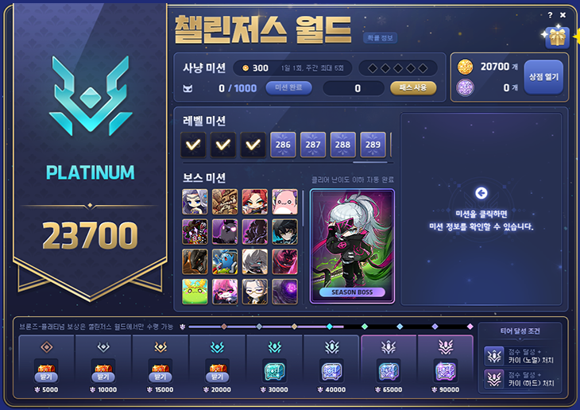

### Points & coins from leveling 

| Level reached | Points each | Coins each |
|---|---|---|
| **260** | **3,000** | 3,000 |
| 261–269 | 300 | 300 |
| 270–274 | 700 | 600 |
| 275–279 | 1,000 | 900 |
| 280–284 | 1,500 | 1,200 |
| 285–289 | 2,000 | 1,500 |
| **290** | **5,000** | 2,500 |

### Points from soloing bosses 
| Boss | Difficulty | Points |
|---|---|---|
| Cygnus / Zakum / Hilla / Pink Bean / Pierre / Von Bon / Bloody Queen | E/N/Chaos/Hard | 100 each |
| Magnus (Hard), Vellum (Chaos) | — | 200 each |
| Papulatus (Chaos) | — | 300 |
| Lotus | Normal / **Hard** | 400 / **1,500** |
| Damien | Normal / **Hard** | 400 / **1,500** |
| Slime | Normal / **Chaos** | 500 / **2,500** |
| Lucid | E / N / **Hard** | 500 / 1,000 / **2,000** |
| Will | E / N / **Hard** | 500 / 1,000 / **2,500** |
| Gloom | Normal / **Chaos** | 1,000 / **2,500** |
| Verus Hilla | Normal / **Hard** | 2,000 / **3,000** |
| Darknell | Normal / **Hard** | 1,000 / **3,000** |
| **Black Mage** | Hard | **6,000** |
| **Seren** | Normal / **Hard** | 6,000 / **7,000** |
| **Kalos** | Easy / **Normal** | 7,000 / **9,000** |
| **Adversary** | Easy / **Normal** | 7,000 / **9,000** |
| **Kaling** | Easy | 9,000 |
| **Kai (season boss)** | Normal / **Hard** | 5,000 / **8,000** |

### Rank requirements (your progression ladder)

| Rank | Points | Requirement |
|---|---|---|
| Bronze | 5,000 | Lv 260 + solo up to **Normal Lotus & Damien** |
| Silver | 10,000 | Lv 260 + solo up to **Normal Gloom & Darknell** |
| Gold | 15,000 | Lv 264 + solo up to **Hard Lotus & Damien** |
| Platinum | 20,000 | Lv 270 + solo all ≤ Hard Lotus/Damien **AND** ≥1 of Hard Lucid/Will, Chaos Tenebris, Chaos Slime |
| Emerald | 30,000 | Lv 275 + all ≤ Hard Lotus/Damien **AND** 3 of {HLucid/Will, CTene, CSlime} — *or* Lv 270 + all ≤ Chaos Tenebris except one |
| Diamond | 40,000 | Lv 277 + all ≤ Chaos Tenebris (no Normal Kai) — *or* Lv 271 + all ≤ Chaos Tenebris **AND** Normal Kai |
| Master | **65,000 + Normal Kai (mandatory)** | Lv 280 + all ≤ Black Mage — *or* Lv 277 + all ≤ E Adversary — *or* Lv 270 + all ≤ E Adversary incl. BM |
| Challenger | **90,000 + Hard Kai (mandatory)** | Lv 285 + all ≤ E Adversary incl. BM + Hard Kai — *or* Lv 280 + all ≤ Hard Seren incl. BM + Hard Kai |

> **You cannot reach Master without soloing Normal Kai, and you cannot reach Challenger without soloing Hard Kai.** These two are hard requirements no matter how many points you bank.

### Rank rewards 

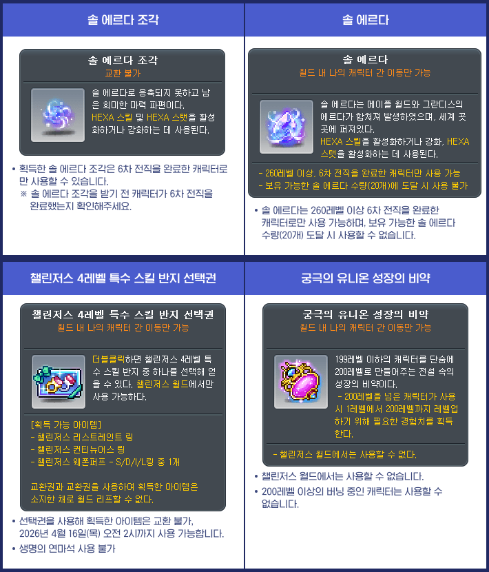

| Rank | Rewards |
|---|---|
| **Bronze** | Bronze Medal + **Challenger Medal-roid Coupon** (android that displays your live rank icon) + **Lidium Heart** + **100 Sol Erda Fragments + 3 Sol Erda** |
| **Silver** | Silver Medal + **Selective Lv 4 Special Skill Ring** (choose **Restraint / Continuous / Weapon Puff** — most classes want Restraint a.k.a. "Roar") + 100 frags + 3 Sol Erda |
| **Gold** | Gold Medal + 100 frags + 3 Sol Erda |
| **Platinum** | Platinum Medal + **300 Sol Erda Fragments + 5 Sol Erda** |
| **Emerald** | Emerald Medal + **20 Ultimate Union (Legion) Growth Potions** (1→200 fodder, usable at any level) + **Legendary Potential Scroll (Lv 200)** + **30 Black (Bright) Cubes**. *Receivable on any world.* |
| **Diamond** | Diamond Medal + **Legendary Potential Scroll** + **Additional Unique Potential Scroll** + **30 White Additional (Bright) Cubes** + **Cozy Winter Set** (cosmetic). *Receivable on any world.* |
| **Master** | Master Medal + **30 Black Cubes + 30 White Additional Cubes**. Master = **max Arcane Seal gate (Stage 5)**, so you can open seals for Legendary whenever. |
| **Challenger** | Challenger Medal **that displays your server clear rank #** + Challenger Furniture. Rank 1 gets the special "**1st Challenger Medal**." Prestige. **Hard Kai mandatory.** |

> The Insigniaroid/Partneroid both also hand you a **Lidium Heart** — that's your free early heart until the Week‑6 Fairy Heart.

### The Challenger passive skill (replaces Legion/Link skills — they're disabled in this world)

Every Challenger World character gets the **[Challengers Beginner]** skill, which **grows automatically as your tier rises**. This is your entire "link/legion/union" replacement, and it is enormous.

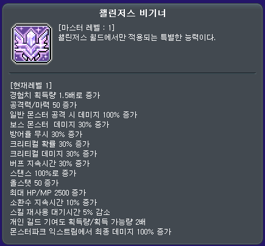

| Tier | The skill's cumulative effect |
|---|---|
| **Beginner (Lv 260, no rank yet)** | 1.5× EXP · +50 atk/matk · +100% normal‑mob dmg · +30% boss · +30% IED · +30% crit rate · +30% crit dmg · +30% buff dur · +100% stance · +50 all stat · +2,500 HP/MP · +10% summon · +5% CDR · 2× guild contrib · +100% final dmg in Monster Park Extreme |
| **Bronze** | normal‑mob dmg → **+150%** |
| **Silver** | atk → **+55** · boss → **+40%** · IED → **+40%** · all stat → +60 · HP/MP → +3,000 |
| **Gold** | atk → +60 · boss → **+50%** · IED → **+50%** · all stat → +70 · HP/MP → +3,500 |
| **Platinum** | atk → +70 · boss → **+60%** · IED → **+60%** · crit dmg → +35% · all stat → +90 · HP/MP → +4,500 |
| **Emerald** | atk → **+80** · boss → **+70%** · IED → **+70%** · crit dmg → +40% · buff dur → +60% · all stat → +100 · HP/MP → +5,000 |
| **Diamond / Master / Challenger** | Everything at Emerald **plus +20% meso & +20% drop rate** |

> **The +70% IED is one single source.** Because IED stacks multiplicatively, one 70% source is far better than seven 10% sources — which is why hitting Emerald/Diamond makes getting "enough IED" almost a non‑issue. The +150% normal‑mob damage is why you one‑shot everything while training.

---

## 3. The Kai season boss

**Kai** is the new season boss and the gatekeeper of the top two ranks. He exists **only in Challenger World**, can be cleared **once per week per Maple ID**, does **not** count against your weekly boss limit, and gives **no Intense Power Crystal**.

| | Normal | Hard |
|---|---|---|
| **Level requirement** | 270 | 280 |
| **HP (official KMS)** | **126 trillion** | **483 trillion** |
| Time limit | 20 min | 20 min |
| Death count | 5 | 5 |
| Enter via | NPC **Annette** (Henesys, Nameless Town, Cernium Square, City of Researchers) | same |

### Kai's mechanics — read this before you pull him

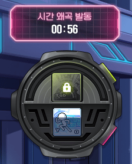

Kai is a **dodge/parry fight**, not a tank‑and‑spank. Four things to learn:

1. **Chrono Gauge** (top of the special UI) fills automatically as you fight, but **drops when Kai hits you**. Keep it high.
2. **Chrono Step** (bottom of the UI) — press the **NPC Chat / Harvest key** to dash and become invulnerable for 0.5s. You bank **1 charge every 5s, up to 3 charges**. This is your dodge button. 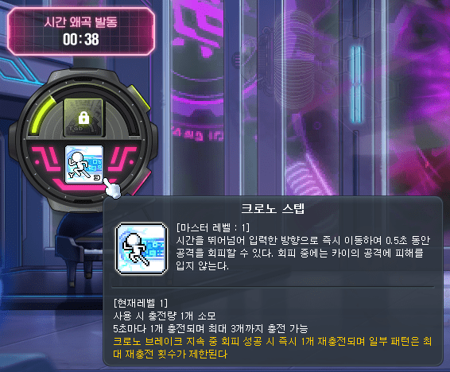 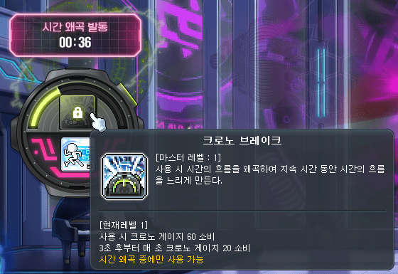
3. **Time Distortion** — about **1 minute in**, Kai speeds up dramatically. Press **Tab** to use **Chrono Break**, slowing time (duration scales with how full your Chrono Gauge was) so you can Chrono‑Step through his attacks. **A successful Chrono‑Step parry during Time Distortion instantly refunds its cooldown.**
4. **The 10,000‑point groggy** — during Time Distortion a score climbs as you dodge. **Reach 10,000 points before it ends → Kai goes groggy and ALL your cooldowns drop by 40 seconds.** This is your burst window. (The score freezes while you're dead, so don't die.)

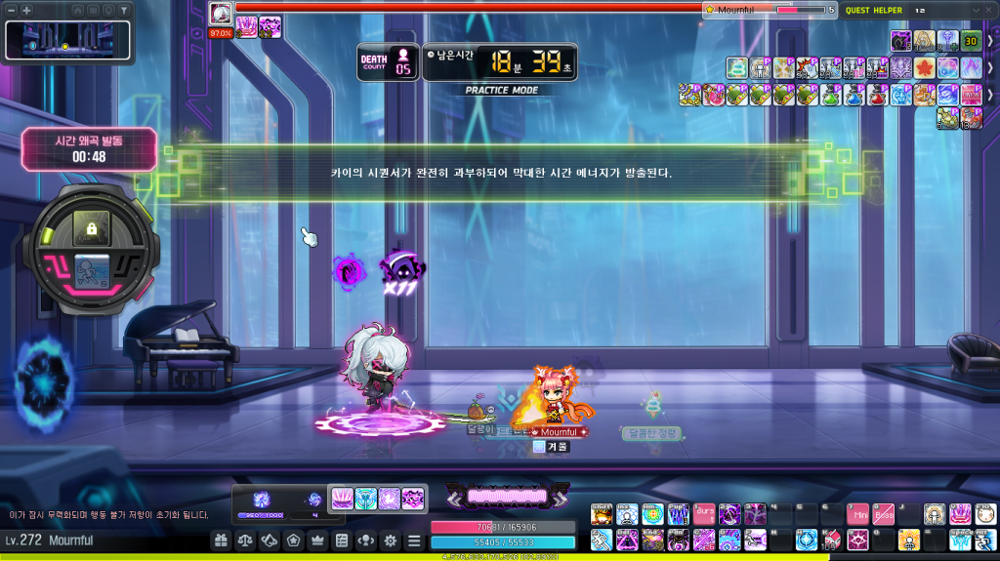

**At 50% HP Kai powers up and his skills get enhanced.** Practice Mode is your friend — learn the rhythm there first; clears in Practice still count for missions and rank.

### Kai's rewards

| Reward | Mode | Notes |
|---|---|---|
| **Gold Meso Pouch** | Both | Instantly +10m mesos on pickup |
| **Unstable Time Fragment** (tradeable) | **Hard only** | **10 fragments → 1 Eternal Hat / Top / Bottom / Shoulder** |
| **Time's Eternal Armor Box** | **Hard only** | 1 Eternal **Hat / Top / Bottom / Shoulder** |
| **Kai's Eternal Armor Box** | Both | 1 Eternal **Shoes / Gloves / Cape** |
| **Kai's Pitch‑Black Accessory Box** | Both | Pitched (Black) accessory |
| **Kai's Basic Sol Erda Fragment Box** | Both | Random frags |
| **Kai's Advanced Sol Erda Fragment Box** | **Hard only** | Random frags (bigger) |

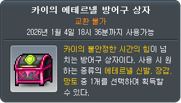 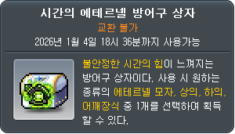 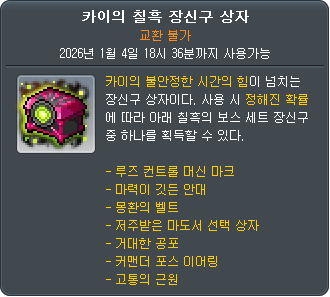 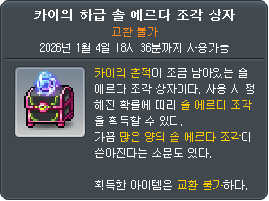 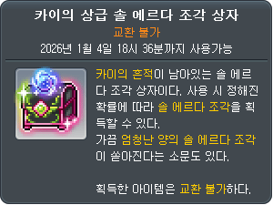

> **Kai is THE source of Eternal armor in this season, and Hard Kai is the only way to farm the Time Fragments + Advanced frags.** This is why the "2‑Eternal" math (below) revolves around how many Hard Kai kills you bank. **Kai gives no Challenge Crests** (item‑burning currency) — that comes from other bosses (§8).

---

## 4. Boss tiers & damage gates

Progress bosses roughly in this order. Each tier is a soft "damage check."

1. **Free bosses** — Hilla, Pink Bean, Zakum, Pierre, Bon Bon (Von Bon), Bloody Queen, Von Leon, Magnus, Vellum, Papulatus, **Normal Lotus, Normal Damien.** Nuked with item burning + the free boss‑accessory set. You can one‑shot most of these in your first couple of hours.
2. **Small step** — Normal Slime, Easy Lucid, Easy Will. Trivial after 6th job, even with early Hexa skills.
3. **Still easy** — Normal Lucid, Normal Will, Normal Gloom, Normal Darknell. Need a bit more Arcane Force. Still pushovers at Lv 260+.
4. **First hard bosses** — Hard Lotus, Hard Damien, Normal Verus Hilla. Lv 266+ recommended; some fragment masteries unlocked.
5. **The gauntlet** — Chaos Slime, Hard Lucid, Hard Will, Chaos Gloom, Hard Verus Hilla, Hard Darknell, **Normal Kai.** Lv 270+, rentals help a lot. Clearing all of this gets you to **Diamond**.
6. **Early Grandis** — Normal Seren, Easy Kalos, Easy Adversary. Lv 275+ recommended; far more complex mechanics — learn them.
7. **Finale** — Hard Black Mage, Hard Seren, **Hard Kai.** Lv 280+ strongly recommended. Hard BM is doable in tier 6 but slow (~1 hr); at tier 7 it's ~30–35 min. **Hard Kai requires Lv 280 minimum.**

### Sacred Power (SAC) gates 

| Boss | SAC required |
|---|---|
| Easy Kalos | 250 |
| Normal Kalos | 350 |
| Normal Malefic Star | 450 |

---
## 5. Item Burning PLUS — your free 22★ gear set

You instantly receive the **8‑piece Challenger's Equipment** (Hat, Top, Bottom, Gloves, Shoes, Cape, Shoulder, Weapon — Zero gets no weapon), matched to your class. You upgrade it by clearing the stage's **specific solo boss** (Practice OK) **and** spending **Challenge Crests** on stages 5–8.

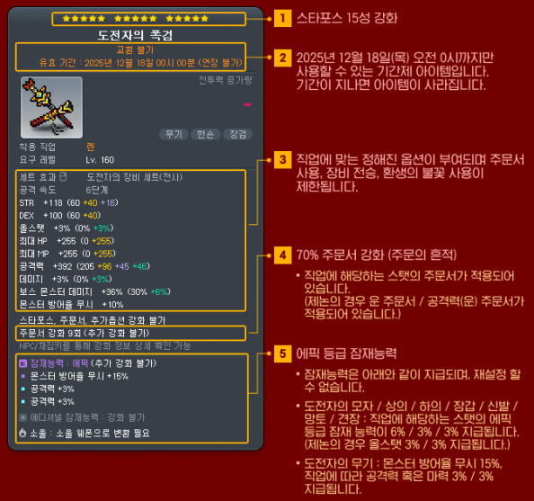 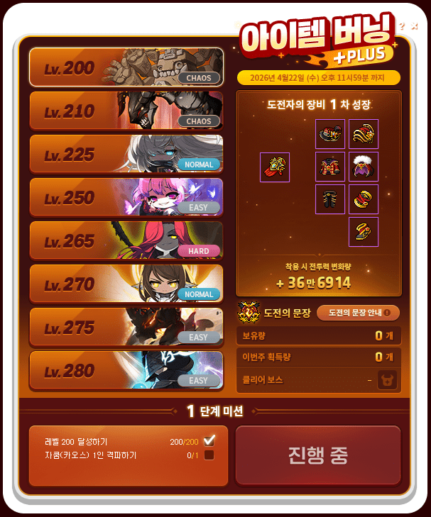

| Stage | Target Lv | **Boss you must SOLO** | Crests | What you get |
|---|---|---|---|---|
| 1 | 200 | **Chaos Zakum** | — | flame tiers + scroll values up |
| 2 | 210 | **Chaos Vellum** | — | **17★** + additional potential revealed |
| 3 | 225 | **Normal Lotus** | — | **18★** + potential → Unique |
| 4 | 250 | **Easy Lucid** | — | additional pot → Epic (armor) / Unique (weapon) |
| **5** | 265 | **Hard Verus Hilla** | **600** | **19★** + **Legendary weapon** |
| **6** | 270 | **Normal Seren** | **800** | **20★** |
| **7** | 275 | **Easy Kalos** | **1,000** | **21★** |
| **8** | 280 | **Easy Adversary** | **1,500** | **22★** |

> You can pre‑clear a *later* stage's boss early, but you can't *advance* past a stage until all earlier stages are done. **Total crests for stages 5→8 = 3,900.**

Crests come **once per week** from your **single hardest** qualifying clear (it does **not** stack — clearing the whole bottom row still only gives you the highest one's value; if you already banked some this week, beating a bigger boss only pays the *difference*).

| Hardest weekly solo boss | Crests |
|---|---|
| Hard Lucid / Hard Will / Chaos Gloom / Chaos Slime | 100 |
| Hard Darknell / Hard Verus Hilla | 200 |
| **Normal Seren** | **300** |
| **Easy Kalos** | **400** |
| **Easy Adversary** | **500** |
| **Hard Seren** | **1,000** |
| Easy Kaling | 1,300 |
| Normal Kalos | 1,400 |
| Normal Adversary **and all higher** | 1,500 |
| ~~Black Mage~~ / ~~Kai~~ | **0 (give no crests)** |

#### Optimal crest plan
- **Week 1:** solo Normal Seren → **300**
- **Week 2:** solo Easy Adversary → **500** (running total 800 → **Stage 5 done @ 600**, 200 banked)
- **Week 3:** solo Easy Adversary → **500** (total 700 → **Stage 6 needs 800**, almost)
- **Week 4:** solo Hard Seren → **1,000** (→ **Stage 6 done**, banking toward Stage 7's 1,000)
- **Weeks 5–8:** Hard Seren **1,000/week** → clear **Stage 7 (1,000)** then **Stage 8 (1,500)**

If you never pass Hard Darknell/Verus Hilla, it takes the full ~20 weeks — so **keep progressing bosses.**

### 5.1 Winter Survival Missions

 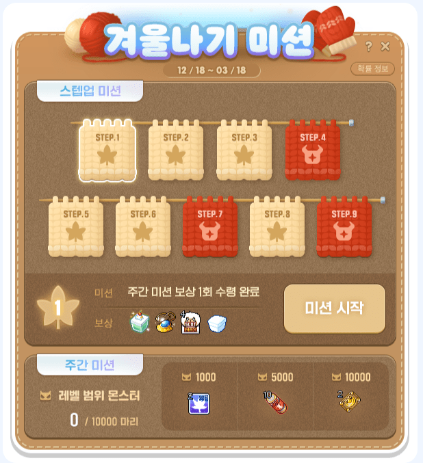

**Step‑Up** (one‑time per Maple ID, new characters only):

| Stage | Do this | Reward |
|---|---|---|
| 1 | Claim a weekly mission once | Sweet Spirit pet (30d) · Spirit Pendant · **4 Selective Max Slot Expansion Coupons** · **Transparent Equipment Set Box** |
| 2 | 5th job | 500 Selective Arcane Symbol Vouchers |
| 3 | Reach 235 | 500 Selective Arcane Symbol Vouchers |
| 4 | **Solo Chaos Vellum** | **Unique Emblem/Secondary Weapon Box** |
| 5 | Reach 250 | **Selective Event Ring + Event‑Ring Legendary scroll + 100 Event‑Ring Meister Cubes** |
| 6 | 6th job | **3 Sol Erda** |
| 7 | **Solo Easy Lucid** | Karma Unique pot scroll + Karma Epic Additional pot scroll |
| 8 | Reach 270 | Winter Survival Muffler |
| 9 | **Solo Hard Lotus** | **100 Sol Erda Fragments** |

**Weekly** (per Maple ID): 1k mobs → 2× 3× EXP coupons · 5k mobs → **10 VIP Boosters** · 10k mobs → **2 VIP Sauna tickets**.

---

## 6. Arcane Seal

This season's "seal" system. You get **3 Seal Control Rods/day** (even offline, **hard cap 20** — never sit at 20, you stop earning). Break seals to get a **Seal's Core** (Normal→Legendary) that you equip for class‑based stats and can enhance to **Stage 12**. Buy 30 wands/week (~5m each) from the in‑UI meso shop — they last 7 days, so **buy late in the week.**

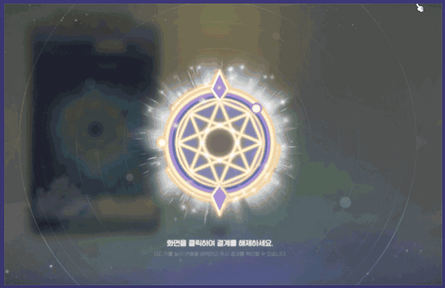 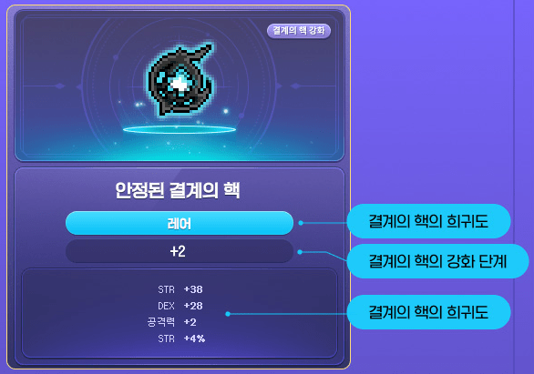

### Which seal you can break is gated by your rank

| Seal stage | Unlocks at |
|---|---|
| Stage 1 (Extra Small) | below Gold |
| Stage 2 (Small) | **Gold+** |
| Stage 3 (Medium) | **Emerald+** |
| Stage 4 (Large) | **Diamond+** |
| Stage 5 (Extra Large) | **Master+** |

### Core rarity odds per stage — why you wait for higher stages

| Stage | Normal | Rare | Epic | Unique | **Legendary** |
|---|---|---|---|---|---|
| 1 | 67.49% | 30.45% | 2.03% | 0.023% | **0.007%** |
| 2 | 52.60% | 31.40% | 15.70% | 0.25% | **0.05%** |
| 3 | 49.95% | 29.95% | 14.95% | 5.05% | **0.10%** |
| 4 | 0% | 29.95% | 62.88% | 6.65% | **0.52%** |
| 5 | 0% | 0% | 91.85% | 7.10% | **1.05%** |

> **Practical strategy:** Day 0, open one for a freebie and settle. Don't *chase* Legendary until **Stage 4 → 5** (Legendary rate **doubles**, 0.52% → 1.05%, and Master removes the worst outcomes entirely). Once you hit Legendary, **dismantle everything else for Seal Energy** and pump that one core. Equipping a higher‑rarity core auto‑extracts the old one into energy.

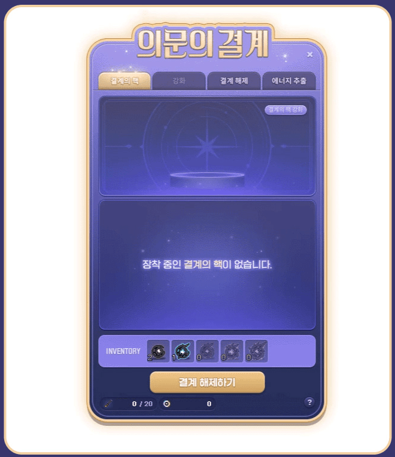 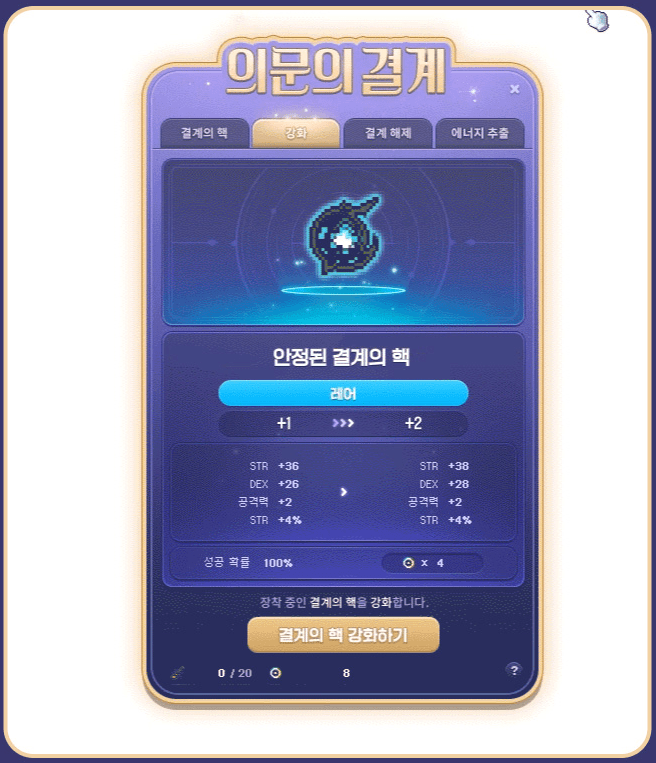

Enhancing uses Seal Energy and gets brutal at the top (11→12 is **0.7%**), so this is a long‑season project, not a Day‑0 one.

---

## 7. The passes

All optional — this is a p2w game — but the core three are a huge power and time multiplier.

### Passes worth buying

| Pass | Cost | What it does |
|---|---|---|
| **Challenger's Pass** | 19,800 Maple Pts | **Strongly recommended.** +200% normal‑mob damage, +20% EXP for ~2 months, plus big node/frag/cube/booster rewards. |
| **Genesis (Gene) Pass** | 30,000 **NX only** | **Strongly recommended.** 3× Traces of Darkness (lib ~4 weeks vs ~11), 6‑man Genesis missions, a boss buff (+20 ATK, +20 all stat, +10% boss, +10% IED, +1,000 HP, +150 AF), and a **3% attack Magnificent Soul** on lib. |
| **Shine Pass / Goddess Pass** | ~35k Maple Pts | Skips you toward ~270. **Shine = Erel/Sia/CTene Mule only;** |
| **Burning Express Pass** | 30,000 NX | Loads of express boosters (juiced, no‑EXP‑cost). |
| **Momentum Pass** | 50,000 NX | **Requires Lv 280** — a week‑3+ thing, not Day 0. See below. |
| **Challenger EXP Duo** | 10,000 NX/week | Situational — feeds EXP to a main‑world char. See below. |

### Challenger's Pass details

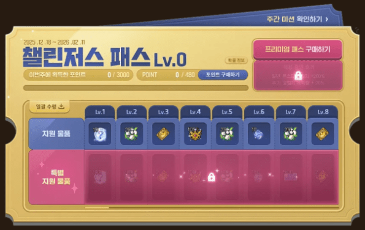

Points come from **weekly missions**: symbol dailies (up to 30×), Monster Park (1–5×), Monster Park Extreme, an Epic Dungeon, weekly bosses (6× / 12×), and mob‑kill tiers (5k–25k+). Premium track shown below.

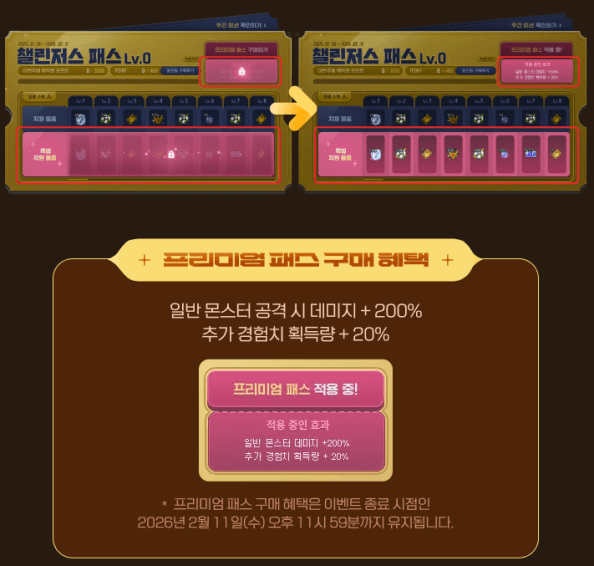

### Burning Pass (Lv 280+ only; Lv 0–10, 720 pts/level)

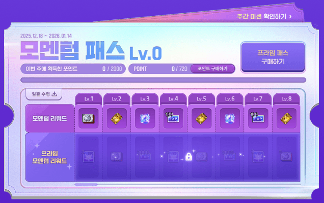

Weekly missions are **Grandis** dailies + Monster Park + mob kills (to 100k). The reward track is loaded with **Mechaberry Farm tickets, VIP Sauna tickets, Sol Erda, and Advanced EXP vouchers** — the Prime track adds 3,000 Advanced EXP vouchers at levels 3/6/9. This is your **280+ leveling accelerator.**

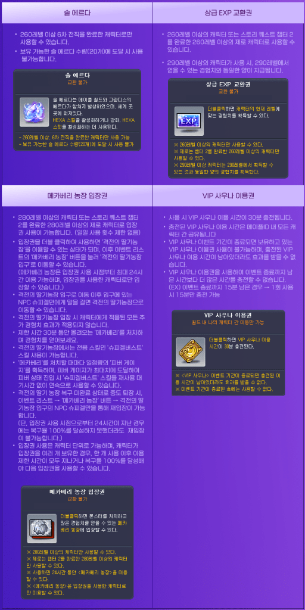 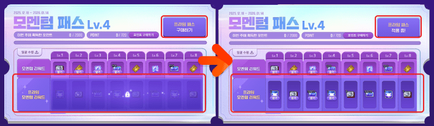

### Challenger EXP Duo (10,000 NX/week)

Put the ticket on a **main‑world** character (Lv 260+), then kill mobs on your Challenger World character to bank **Duo Points** the main‑world char spends as EXP. **Official rates:** first **200k** mobs = **4 pts** each (most efficient), next 80k = 3, next 95k = 2, rest = 1, **capping at 645k mobs/week for 1.5M points.** At Lv 291 that cap is ~5.3%/week (~31 hrs). **200k mobs (~10 hrs) is the realistic sweet spot.** Only worth it if you grind heavily.

### Challenger Partner

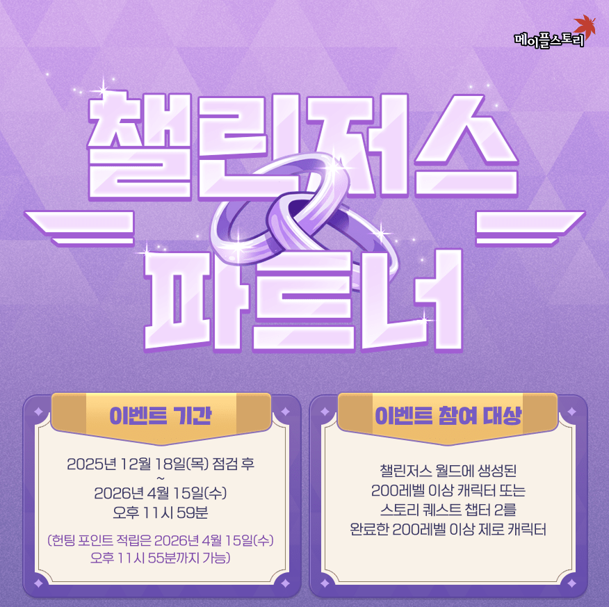 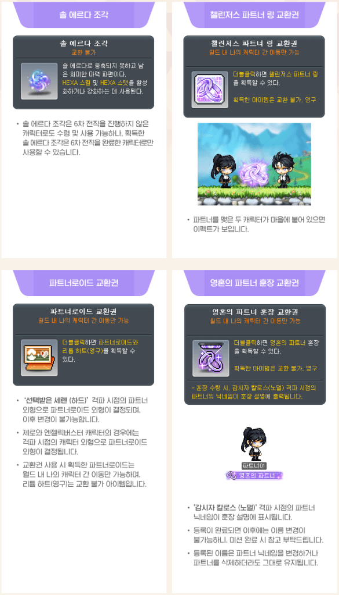

Pick carefully — **you're locked in by contract and can't change partner.** Duo missions (Practice OK):

| Duo this boss | Reward |
|---|---|
| **Hard Will** | 100 frags |
| **Hard Verus Hilla** | 100 frags |
| **Easy Adversary** | **Partner Ring** (displays in towns when both wear it and stand together) |
| **Hard Seren** | **Partneroid** (android with your partner's appearance at clear) + **Lidium Heart** |
| **Normal Kalos** | **Soul Partner Medal** (shows partner's IGN at clear) |

Partner *hunting* EXP is intentionally mediocre (you bank up to 100k Hunting Points/week from your partner's kills) — don't rage at your partner over it.

---

## 8. Pre‑patch prep (do this the week *before* launch)

- **SAVE your Sol Erda "order"/request this week. Do NOT complete it.** It's once per account — claim it the moment you hit 260 (before weekly reset) for free progress (~90–180 frags).
- **Save your MVP weekly perks** (Forex coupons, etc.) to claim on Day 0 if the game comes up in time.
- **Preload NX / Maple Points.** Roughly **300k NX / ~$300** covers all the passes.
- **Pick your IGN.** If the name is held by an existing character, delete that character **24 hours before** launch (it must already be in ghost form with the 24‑hr cooldown expired), then be ready to delete the placeholder again at launch.

---

## 9. DAY 0 — the full sequence

This is the intense part. Plan for **~3 hours of game uptime before reset** (minus download time). One creator timed a similar run at ~2h46m. Put the checklist on a second screen, game full‑screen, minimal distractions.

### A. Get in and make the character
1. **Win the download race;** log in the instant the game is up.
2. **Pick the correct world: Challenger Heroic.** There will be **two** heroic worlds — there is only **ONE Challenger Heroic** to pick; do **not** pick Interactive. People brick their season here every year.
3. **Create the character.** On the creation popup, **select the MIDDLE option.** (The wrong one costs you the name or forces a relog.)
4. **Designate as the Hyper Burning MAX character** before hitting 260. (In GMS you confirm by typing the prompt exactly — type **"beyond burning"** in the box, nothing else.)

   
5. **Skip every tutorial cut‑scene** and get to **Lv 30.** Just go.

### B. Power to 200 and set the foundation
6. Accept the **Challenger World event** and claim the **creation reward** (top‑right of the Challenger World UI).
7. **Equip the Maple Pearl set. Use Tera Blink to 200** (~10 min of menu‑gaming; level skills as you go).
8. **Get 5th job** (very fast now — it blinks you to all the NPCs).
9. **Claim Hyperburn rewards — but do NOT *use* the Flame titles yet.** Save them; title order matters (see §14). You CAN claim the Infinite Flame coupon from the hyperburn UI, just don't USE it from inventory.

   
10. **Buy the Shine/Goddess Pass premium** (~35k Maple Pts). Redeem the box for the **EXP title + Pendant of the Spirit**; equip and copy the Pendant immediately. Put **EXP into hyper stats** and Equip the **EXP Title from Shine Pass**
11. **Redeem 20 node stones → max Holy Symbol** (boosts Strawberry Farm EXP).
12. **Start Professions + Auto Harvest immediately** — it counts down ~2.5k hits even offline, so the sooner it runs, the sooner you get juice. Start this ASAP so every day you can run the full window.
13. **Redeem the Challenger's Pass** for the mob‑damage bonus (+200% normal‑mob damage — great for Monster Park Extreme and training).
14. **Open one Arcane Seal** — just one; whatever you get, slap it on. Free damage.

### C. The leveling‑box sequence (→ 266, then → 270)

Use the Shine/Goddess Pass + Summer Countdown reward boxes. **Use the *untradeable* vouchers first** so you can bank tradeable strawberry/EXP/magpots for a future mule or Kinesis.

**Strawberry first:** 2 strawberry tickets (Lv 200 box) → ~215. *(The Lv 200 box also gives 3 magpots — save them.)*

**~13.7k EXP vouchers, 215 → 250:**
- *Free* Power of Time => 1k EXP Vouchers 
- *Free* Lv 210 Box => 1k EXP Vouchers
- **Payed** Lv 225 Box => 5k EXP Vouchers
- *Free* Lv 230 Box => 2k EXP Vouchers
- *Free* Power of Fate => 5k EXP Vouchers 

**250 → 260:**
- Use **3 magpots** (**Paid** Lv 200 box) + **1 magpot** from Summer Countdown → 2

**260 → 266** (after setup):
- *Free* Lv 220 Box => 1k EXP Vouchers
- *Free* Lv 240 Box => 3k EXP Vouchers
- **Payed** Lv 240 Box => 10k EXP Vouchers
- *Free* Lv 250 Box => 5k EXP Vouchers
- **Payed** Lv 260 Box => 10k Advanced EXP Vouchers

### C. Alternative Leveling Path (200→260)

If you wana save ressources for Kenesis/Other Mules follow this route.
Now that this might hender your progress when trying to reach Har Kai week 3

- Use untradeable vouchers first to save tradeable ones for mules/Kinesis

- Strawberry farm 200->210
- 1,000 vouchers (Power of Time) → 215
- 1,000 vouchers (top 210 box) → 220
- 1,000 vouchers (top 220 box) → 225
- 5,000 vouchers (bottom 225 box) → 235
- 2,000 vouchers (top 230 box) + 5,000 vouchers (Power of Fate) → 240
- 3,000 vouchers (top 240 box) + 10,000 vouchers (bottom 240 box) → 250
- Claim but don't use 5,000 vouchers from top 250 box
- Use 1 Mag Pot (from bottom 200 box) + 1 Mag Pot (Summer Countdown) → 255
- Use remaining vouchers → 260

### D. Gene weapon + Genesis (Gene) Pass
15. **Grab the Gene weapon, redeem the Genesis Pass, and PROC it now.** Remember it's **30k NX, not Maple Points.** Its boss buff (+20 ATK, +20 all stat, +10% boss, +10% IED, +1,000 HP, +150 AF) applies on **Black Mage commanders and above only** — not Slime or early Grandis.

### E. Character setup
16. **Start the Gene (liberation) quest. Skip the Cernium story.** Don't rush 6th job yet unless you want easier item‑burning bosses (6th job is much faster this patch — do it before or after, your call;). 
17. **Unlock Ascent** If you do unlock 6th job, unlock your Ascent to have an easier time with early bosses.
18. **Unlock all symbols** — visit every town. Dailies/weeklies push symbols to ~Lv 15 by week 1. **Fuse all Arcane symbols** (visit every town to unlock them first). Between hyperburn (~Lv 7) and the pass (~Lv 10), fusing lands you ~Lv 11–13. 
19. **Fuse the Cernium symbol.** 
20. Use the **trait boost potion on Charm** (Charm → final damage via the Insight profession).

    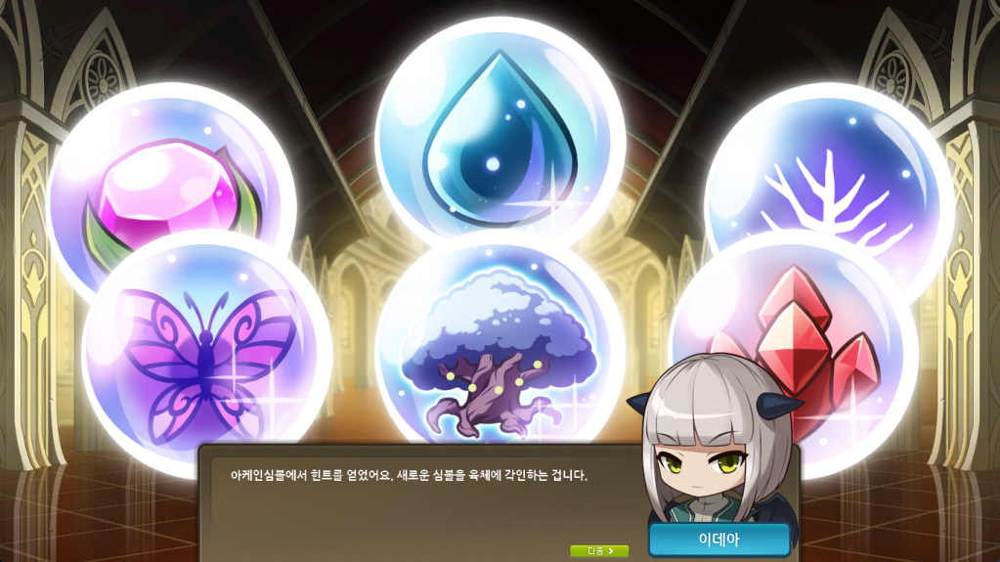 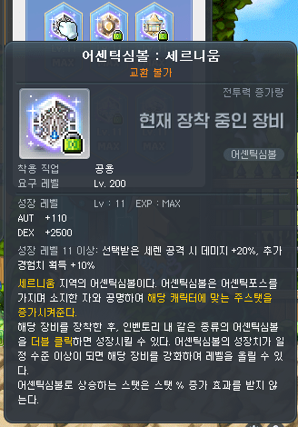
21. **Equip the Burning Boss Accessory box**, the **Abyss Hunters ring** (Lv 230 hyperburn reward), and **all Event Rings** (all event rings are identical). In the pendant selector pick **DOM (Dominator) over Abso** from *both* selectors. Put on the **Hyperburn outfit** (Lv 230 reward).
22. **Start every event** Challenger Partner, Arcane Seal, Burning Beyond, Item Burning PLUS, Night of Phantasms, Auto Harvest 
23. **Activate every pass:**  activate Challenger Pass, Shine Pass, Genesis Pass, Burning Express.

### F. Claim & distribute event rewards
24. Claim the rest of **Summer Countdown + Shine/Goddess Pass:**
    - **Honor (80)** → inner‑ability rolls. 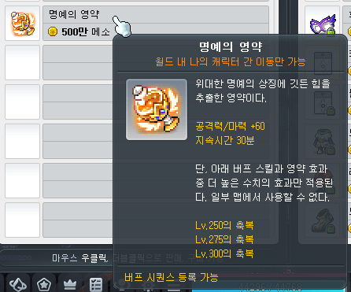
    - **20 EXP nodes** → max V Matrix (100 EXP nodes = 300 regular nodes in the new system). 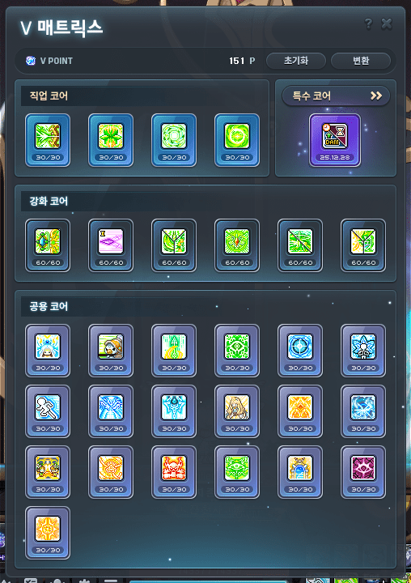
    - **Symbol selectors** → distribute evenly for **max Arcane Force.**
    - **90 frags** → use on your character.
    - **10 boosters** → save for training.
    - **Unique scroll** → save for secondary/other gear.
    - **Event ring** → claim the one(s) you don't have (all identical).
    - **Legendary ring scroll** → use on an event ring.
    - **100 event cubes, 50 black flames, 20 bright cubes** → **save** for now.

25. **Set skill keybinds, hyper skills, hyper stats, pets.** For the **vac pet**, the min‑max move is to **save it** until you have meso/drop gear. Join your class Discord; learn your rotation.
26. **V Matrix:** max **common nodes, skill nodes (trios), Holy Symbol, Goddess**, plus Weapon Aura / Mana Overload. **Leave Speed Infusion, Combat Orders, Advanced Blessing, Sharp Eyes, Rope Lift at level 1** (they don't scale). The passes hand you tons of points, so this is fast.

### G. Day‑0 cubing & scrolls
27. **Event ring selectors (~4):** from Summer Countdown, the **Paid** Lv 210 box selector, and the Lv 210 Hyper Burn Ring Selector Coupon — **pick a *different* ring each time** so you collect all three event rings **+ the Challenger‑exclusive Hyper Burn Eternal Flame ring** (heroic‑only).

3x Legendary scrolls
- 1x from Summer Countdown (Ring Only) => Ring 1
- 1x from the Lv 260 Shine box, 
- 1x from Winter Survival (Ring Only) => Ring 2

5x Unique scrolls
- 1x from Summer Countdown => Ring 3
- 2x from the Lv 230 Shine box and Power of Life, => Frozen Secondary + Accessory
- 1x from Winter Survival => Ring 4
- 1x from Night of Phantasms

28. **Legendary scrolls (3):** one from Summer Countdown, one from the Lv 260 Shine box (Save for later), one from Winter Survival (Step‑Up Stage 5 gives an Event‑Ring Legendary scroll). Then use **solid cubes** to roll the ring for **item drop.**
29. **Cube Rings for Drop/Meso Line.** Once you hit an item‑drop line, run with it. (Item drop is only really useful for Princess No on Day 0.)
30. **Winter Survival event:** Step‑Up missions hand out a ring selector, a 30‑day spirit pet, cubes, transparent‑equipment coupons, a **Unique Emblem/Secondary box (solo Chaos Vellum)**, and huge symbol vouchers. Knock out the early stages on Day 0. (Full table in §8.)

### H. Item burning + the Day‑0 money run
31. **Put on item‑burning gear** (the Challenger's Equipment, §8). **Prog Item Burning PLUS through Stage 4 (Easy Lucid).** Then do **all daily/weekly bosses.**
32. **Day‑0 only: sell all your crystals now** (you'll get a fresh batch at reset — free double‑dip). *If there is no Day 0, DON'T sell — you'll get better crystals later in the week.* **You can only sell 180 crystals/week account‑wide** — if you boss on multiple characters, sell the **highest‑value** crystals first.
33. **Push item burning to clear Easy Lucid (Stage 4).** Path: Chaos Zakum → Vellum → Normal Damien → Easy Lucid. All doable in **Practice Mode** (full buffs). The 6 pre‑cubed boss accessories + the free Dominator make Easy Lucid an easy clear. You also earn **Ignitia keys**.
34. **Money run** (longest part, ~30–45 min): clear everything you can. Expect **~1.7 bil.** Spend it immediately on the Day‑0 gap items from the **Meso Shop → Special tab:** 
    - **2 Mecha Berry tickets** (these reset on **weekly reset**, not event reset — buy now, buy again at reset).
    - **Express boosters** — 10 for 300m, 2 for 1 bil. *Save ~1 bil of Mecha Berries for the Lv 280 power spike* (they scale to the 290s — ~3T EXP at 280, up to ~6T — and last to ~September).
    - **Seal wands** — ~150m for 30, for the Arcane Seal.
    - *Lower‑spend option:* at 1.45 bil get 4 Mecha Berry + 5 Express boosters; then you can skip Easy Lucid/Normal Slime and just do Damien‑and‑below + Vellum/Hilla.
35. **Auto‑clear Epic Dungeon / High Mountain** (saves ~30–60 min on low spec; ~40 frags + ~0.5 Sol Erda + ~13% EXP).
36. **Monster Park** Remeber to put Event Buffs into Monster Park EXP (~5 min solo, juiced by the Challenger Pass +200% mob damage) and **Monster Park Extreme** (~14% EXP).
37. **Burn the 10 express boosters while getting the 5k‑kill weekly** (~17 min; boosters last ~100s each, ~36% total EXP). Use the highest map you can access (~Lv 269 mobs); place your summon/mobbing skill for max efficiency. Do the **Hotel Arcus daily** (the one daily you do manually on Day 0 — passes auto‑clear the rest), then **7 Monster Park runs** for the final bump.
38. **End Day 0 around 270** (per the XP‑timing tip) with all dailies done. (Training with boosters adds more on top.)

### I. Day‑0 frag / Sol Erda haul (reference)
- **Claim your Sol Erda order/request** the moment you can (you saved it pre‑patch).
- **3 Sol Erda + 50 frags** from Power of Life (right side)
- **200 frags** from the Lv 260 gift
- **~100 frags for 4k coins** in the Challenger Shop
- **~90 frags** from the Summer gift
- **Hit 5k points on Day 0 → +100 frags + 3 Sol Erda** (Bronze rank reward)
- **~40 frags** from High Mountain auto‑clear
- **Total Day 0 estimate: ~500+ frags** immediately available

### J. Day‑0 recurring checklist 
Event check‑ins → set **event buffs to Monster Park XP** (Sacred Power next, then Arcane Force) • daily bosses • weekly bosses • Ursus (~120m/day) • Monster Park (7 runs) • symbol dailies • Monster Park Extreme • weekly symbol quest • **5k mobs** • Challenger World check‑in (1k mobs) • Burning Express check‑in (1k mobs) • claim Challenger Partner XP • High Mountain • Guild Covert • **20 map procs** (the "dog" research mission) • **buy out the shops** (Arcane Seal wands, Express boosters, Mecha Berry, 3× from boss/Challenger shops) • complete **Challenger Pass missions.**

---

## 10. Day 1 & the daily routine

### Day 1 (the morning after)
- **Finish anything Day 0 ran out of time for:** rest of the boss list, rest of the leveling boxes, the rest of Winter Survival's early stages.
- **Continue the XP plan toward 275.** Keep using Mecha Berries / Express boosters on the highest map.
- **Re‑buy** the weekly‑reset shop items if a reset has now passed (Mecha Berry, Express, seal wands).

### The daily routine (every day, all season) — burn this into muscle memory
- **Event check‑ins**, then put **event buffs into Monster Park XP** (Sacred Power & Arcane Force next best).
- **Daily bosses** + **symbol dailies** + **Ursus** (~120m/day) + **Monster Park** (7 runs).
- **5k‑mob research**, then **Challenger World check‑in** (1k) + **Burning Express check‑in** (1k).
- **Make another Lv 200 Tera mule via Tera Blink** to spend your *extra* Monster Park runs (you get 14/day = two sets of 7).
- **Prog Item Burning / Winter Survival** (at least to Easy Lucid practice).
- **Follow the XP plan** toward 270 → 275 → 280.
- **Manage crystals:** sell only **180/week** account‑wide, **highest‑value first.**
- **Arcane Seal:** never sit above 20 seals (you get 3/day even offline). Buy wands the day before shop reset, use expiring wands, and if you roll Legendary, stop saving and open for essence to tier up.

### Weekly housekeeping (two deadlines)
- **Before EVENT reset (Tue, GMS):** claim all **Challenger Pass mission XP** + the **10k‑mob research** mission.
- **Before BOSS reset (Wed, GMS):** Angler/High Mountain, Monster Park Extreme, weekly symbols, 14 weekly crystals, Guild Covert; **buy out** Arcane Seal / Express boosters / Mecha Berry (~1.5 bil); **use expiring seal wands**; buy 3× from boss/Challenger shops; claim Challenger Partner XP.

---

## 11. Week‑by‑week plan (Weeks 1–12)

> CW3 is ~12 weeks. Weeks 1–7 are the structured climb; weeks 8–12 are "solo the hardest boss you can, party higher, grind Eternals/pitched." Levels assume the passes + ~2 hrs/day farming — you'll likely beat these if you farm more.

### Week 1 — Establish (target Lv 270, ideally 275)

**Character setup this week:**
- **Inner ability:** 10 Miracle Circulators (Lv 225 hyperburn reward) + Honor → first good line.
- **Emblem:** Winter Survival Stage 4 box (Unique Emblem) if you cleared Chaos Vellum; else use what you have.
- **Secondary:** unique scroll on the Frozen secondary; aim for any single useful line (attack%/boss%).
- **Event rings:** claim all event rings; use the event‑ring Legendary scroll on one; use the **150 Event‑Ring Meister Cubes** (50 from Lv 210 + 100 from Winter Survival) to push **all** event rings toward Legendary — cheap tech before bright cubes are affordable. Then aim for **4‑line meso** on them.
- **Hexa:** **Janus to Lv 10 first** (grinding isn't miserable), then your class Discord's Hexa order.
- **Professions:** profession‑max potion (Shine/Goddess Pass) → max **Insight** (final damage).
- **Arcane Seal:** open for a rare and settle; don't chase tiers yet.
- **Symbols:** combine the Lv 5 Cernium (hyperburn 260 reward) with Lv 5/10 symbols from the pass; save SAC symbols for Arcus/Odium; distribute Arcane Force selectors evenly.

**Rank climb (claim at each step):**
- Clear Easy Lucid in **Practice Mode** → **Silver** (10k): claim frags + the **Lv 4 Special Skill Ring**, upgrade Hexa.
- **At Lv 270, rent gear** (everything except the free Silver ring). Save **~2 bil** (you need it for both the Chaos Tenebris clear and the rental). All accessories incl. totems ≈ **1.6 bil.** **Rentals last 2 days now** — rent near week's end. Available until **Nov 10, 2026.**
- Clear Hard Lotus/Damien + Hard Will → **Gold** (15k).
- Clear CTene / Hard Lucid / Chaos Slime → **Platinum** (20k): claim **300 frags + 5 Sol Erda.**
- If you need dammage try to tier up your Arcane Seal and/or Emblem/Secondary 
- **At Lv 271, clear Normal Kai → Diamond** (40k): claim Legendary pot scroll + cubes + Cozy Winter Set.
- Tier up Arcane Seal to Unique +6

**Items:** roll **5‑line meso, 4‑line drop** across 9 accessories first; *then* hybrids/double‑drop. Always keep **~1.4 bil** banked for next week's rentals.

**Hexa frags this week (~2,300+):** CW missions ~600 · Challenger Shop ~530 · Kai ~30 · Winter Survival ~100 · Burning Beyond ~100 · Shine/Goddess Pass ~300 · High Mountain/Angler 40–95 · Day 0/1 Erda request 90–180.

- **Prepare 3 Tera‑Burning mules:** use your 3 Tera Burning slots to make 3 mules, blink them to 200, gear them with the abundant node stones + free event cubes, and they'll clear Normal Lotus & Damien easily — together generating **~4.2 bil/week** in boss income (huge on Heroic where mesos are scarce). **Save a character slot for the Kinesis hyperburn in July.**

- **Try Normal Seren solo.** Clearing it week 1 fast‑tracks item burning (300 crests + Stage 6 boss). Most can't yet — if not, **party Hard Seren / Easy Kalos.**

### Week 2 — Push to 280 (target ~280)

- Solo **Normal Seren** (300 crests + the Stage 6 boss).
- **Party Easy Kalos / Easy Adversary** if you can't solo them.
- **Crests:** solo **Easy Adversary → 500.** (With week‑1's 300 that's 800 banked → **Stage 5 done.**)
- **Duo or trio Black Mage before the monthly reset** so Genesis lib is as fast as possible — *don't* take a bigger party than that.
- **Kill Normal Kai again** (chance at a pitched box).
- Clear **Duo/Trio Black Mage** before June 30
- **Level for max final damage:** Black Mage wants **Lv 280**; Hard Kai's max damage bonus is at **Lv 285** — 285 is a good early ceiling.

### Week 3 — Liberate + the Kai gamble (the big week; target ~280+)

- **Solo Black Mage and LIBERATE.** With Genesis Pass, lib is ~4 weeks instead of ~11; after lib you get a **3% attack Magnificent Soul** from any BM commander.
- Solo **Normal Seren** again.
- **Party Easy Kalos / Easy Adversary** if you can't solo them.
- **Crests:** solo **Easy Adversary → 500**, working toward **Stage 6 (Normal Seren boss, 800 crests).**
- **Now that you're 280:** start **Mecha Berry + Burning Pass + Mechaberry Farm + Nightmare Paradise.** Mecha Berry ≈ **7% EXP/ticket** at 280.
- **Rank:** Lv 280 + BM/N Seren/E Kalos → **Master**.
- or **Rank:** Lv 283 + BM/N Seren → **Master**.
- Master = **max Arcane Seal gate (Stage 5)** → open seals for Legendary.
- **The 2‑Eternal deadline:** you must **solo Hard Kai by Week 3** to make **two** full Eternals before the season ends. Most people won't this early — that's okay. **The math:** ~**12 Kai kills** across the season (e.g. Normal Kai ×2 + Hard Kai ×10) banks enough coins/boxes for **2 Eternal pieces.**

### Week 4 — Hard Seren + armor (target ~280–285)

- Solo **Normal Seren** weekly; try **Easy Kalos/Easy Adversary** solo.
- If not Party **Easy Kalos/Easy Adversary** or **Normal Kalos/Normal Adversary** depending on your hands
- **Liberate** if you haven't.
- **Item burning:** **Solo Hard Seren → 1,000 crests** → push **Stage 6/7.** Major milestone.
- **Gear:** your liberated Genesis weapon (well‑flamed, half‑lib) already beats the item‑burning weapon — switch to it.

### Week 5 — Start Hard Kai (push beyond 285)

- **Solo Easy Kalos + Easy Adversary.**
- Begin attempting **Hard Seren / Hard Kai** solo — realistically when most people first get strong enough.
- **Rank:** Lv 280 + BM/Hard Seren/E Kalos/E Adversary/**Hard Kai** → **Challenger** (90k). You can skip Hard Seren but **never Hard Kai.**
- **Crests:** Hard Seren **1,000/week** → Stage 7 (1,000) → Stage 8 (1,500).

### Week 6 — Fairy Heart + continued pushing

- Keep attempting Hard Seren / Hard Kai; weekly Normal Seren.
- **Key unlock:** the **Week‑6 Night of Phantasms check‑in gives the Fairy Heart** (Lv 130, upgradeable to 20★). Also one from the Shine Pass login reward — **save the spare for a mule/Kinesis.** (Use the free Lidium Heart from Bronze rank until now.)
- After Fairy Heart, you're eligible to upgrade to **Plasma Heart once you defeat Hard Kai.**

### Week 7 — Full burning set

- **Solo Easy Adversary** to finish **Stage 8 → full 22★ item‑burning set.** The culmination of 7 weeks of boss progression.
- **Kinesis prep:** Kinesis launches ~July 22 (week 6–7). If you've hoarded resources on a mule, dump everything onto Kinesis now — his week 1 ≈ everyone's week 7.

### Weeks 8–12 — Maximize

**Every week: solo the hardest boss you can, party anything higher.**

**Eternals (party schedule):**
| Boss | Mode | Pieces | SAC | Notes |
|---|---|---|---|---|
| Hard Kai | Solo only | Full | — | Only Kai source |
| Kalos | Normal+ (party) | Full | 350 | Solo Easy = strong enough for Normal party |
| Adversary | Normal+ (party) | Full | — | Solo Easy ≈ barely enough for Normal |
| Kaling | Easy+ (party) | Half (Easy)/Full (Normal+) | — | High failure rates — be stronger |
| Malefic Star | Normal+ (party) | Full | 450 | Need solo‑Normal‑Kalos strength |

**Long‑term goals:**
- Build **Eternal hat/top/bottom + Arcane shoulder/shoe/glove/cape** to ~20–21★. **18★ Eternals already beat 22★ Challengers**, and you can star to 22★ without booming (just expensive past 18★).
- Work on **pitched items** — with boom‑free 22★, **9‑set is realistically reachable**; the 10th piece is refreshing Black Hearts or a Total Control drop.
- **Trace Restore missions** weekly (Practice OK — points carry to your main world). Cap **12 Star Spec boxes/day.** Loot **Pitched Whisper Crystals** and save **390 for a Genesis Badge** before spending.

---

## 12. Gear

### 12.1 Meso / drop farming gear (top priority for active players)

Because Challenger World has so much normal‑mob damage, **any accessory that can hit 20% meso or drop is fine.** Build toward **100% meso + 80% drop** (one meso‑or‑drop line per equip across 9 accessories), then roll **hybrids/double‑drop.**

**Easy pieces:** Silver Blossom Ring (quest) · Treasure Hunter John Ring (~5 min NLC quest) · 2× Event Ring · Zakum Face · Aquatic Letter/Zakum Eye · Dea Sidus/Horntail/Hilla Earrings · Mechinator Pendant (Mariarium) · Greed Pendant (+20% equip drop, doesn't break the 200% cap) · Condensed Power Crystal (pocket).

**Order:** 5‑line meso, 4‑line drop → hybrids/double‑drop → **100% meso + 200% drop.** Grinders: meso% first. Non‑grinders: drop% first (loot bossing gear faster). **Pop the vac pet only once this gear is ready.**

### 12.2 Damage gear, armor & Eternals

**You barely touch damage accessories early** — rentals + the boss‑accessory box cover most slots. You only need to fill: **3 rings, pocket, 2nd pendant, secondary, emblem, medal, heart, badge.**

- **Rentals (Arthur's):** rent **everything** once/week near week's end (last ~2 days). All accessories incl. totems ≈ **1.6 bil.** Available until **Nov 10, 2026.**
- **Weapon:** stick with the item‑burning weapon **until you liberate** (a well‑flamed half‑lib Genesis weapon already beats it). Don't build an Arcane weapon if you have the Genesis Pass.
- **Secondary:** Frozen one; aim for **2‑line Boss%/Attack%.** The upcoming **Astra secondary** (July patch) makes the choice barely matter — any secondary transfers into it later.
- **Emblem:** 1 IED line is fine at low rank; move to **2‑line Attack% + IED** (never 2‑line IED), then **2‑line Attack%** at Platinum+. (The Diamond passive's single 70% IED source means you need little IED from gear.)
- **Armor:** item burning carries you a long time; replace one piece at a time with **Ignitia keys** (no set‑effect loss; not usable on Challenger/Eternal).
- **Heart:** Lidium (free, Bronze) → Fairy (Week 6) → **Plasma (after Hard Kai).**
- **Medal:** Vellum or Monster Park medal early.
- **Android:** free **Challengers Insigniaroid** at Bronze (displays your live rank icon).

**Post‑rental accessory goals (long‑term):** OZ/Restraint Ring (Silver) · Continuous Ring (10k pts) · Superior Golux (ring/belt/earring, run Golux daily) · Slime Ring / Meister / Endless Terror · Daybreak Pendant (+ Slime Ring = 2‑set Dawn) · Twilight Mark/Sweetwater face · Black Bean Mark eye · Holy Pink Beauty/Curse Spellbook pocket.

---

## 13. Title order (don't overlap them)

You get **three** strong titles across this patch — used back‑to‑back they cover ~**6 months.** Don't waste overlap.

1. **Eternal Flame** — from your first Arcane Symbol after 5th job (60‑day title from the hyperburn creation reward). Use it until 270. **Do NOT auto‑claim/use Infinite Flame early** — you can claim the *coupon* from the hyperburn UI, just don't USE it.
2. **Burning Beyond** — after Lv 270 + finishing the Burning Beyond track. Same stats as Infinite Flame **but +100 SAC (vs 50) + 100 Arcane Force** — huge for early Grandis. **Use this immediately at 270.** Lasts ~2 months.
3. **Infinite Flame** — claim **only after Burning Beyond expires** (~2 months). By then your own SAC makes the 50‑SAC gap irrelevant, giving you ~4 more months of a strong title.

---

## 14. Events quick‑reference

### Arcane Seal (full system in §9)
3 rods/day (offline), hard cap 20; 30 wands/week (~5m) last 7 days → buy late. Don't chase Legendary before **Stage 4→5** (rate doubles). Hit Legendary once, then dismantle the rest for Seal Energy.

### Challenger Shop
**General coins:** 3× EXP Coupon (100c, **7/wk**) · Selective VIP Buff (30c) · **Sol Erda Fragment (40c, limit 500)** · Sol Erda (2000c, 5) · Strange Cube (5c) · Meister Cube (100c, 100) · Strange Additional Cube (20c) · 100% Epic/Additional pot scrolls (150c, 30 each) · 17★ scroll (3000c, 3) · 1000 Spell Traces (100c).
**Special (Advanced) coins:** Abyss Rebirth Flame (1c, 150) · **10 frags (1c, limit 10 = 100 frags)** · Sol Erda (3c, 20) · Black Cube (1c, 20) · White Additional Cube (2c, 20).
> So the shop yields **~600 frags/week** (500 via regular coins + 100 via advanced). Buy 3× from the boss coin shop too.

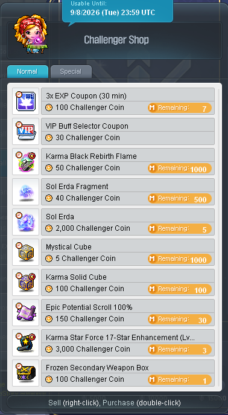 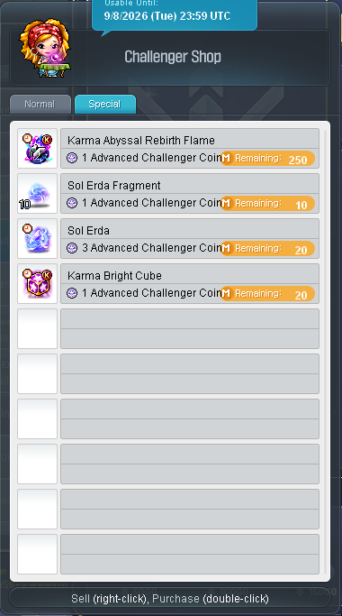

### Hunting Mission (Coins, not Points)
1,000 mobs in your level range → **300 coins**, 1×/day, **5×/week** (solo or no party). A **Hunting Mission Pass** (2,000 Maple Pts) can backfill a missed day.

### Trace Restore / pitched (long‑term)
Run weekly (Practice OK — points carry to your main world). Cap **12 Star Spec boxes/day.** Save **390 Pitched Whisper Crystals** for a Genesis Badge before spending. **Don't** run Trace Restore early — it transfers only after Challenger World ends.

---

### Sources & accuracy

- [MapleStory Challenger World 3 Ultimate Progression Guide](https://www.youtube.com/watch?v=RMPO6cgyx8E)
- [MapleStory Challengers World Season 3 COMPLETE DOCUMENT!! (Gearing, Progression, Events, & More!)](https://www.youtube.com/watch?v=1-q1KGeAiEU)
- [Challenger World Day 0 Checklist | Maplestory](https://www.youtube.com/watch?v=-f3ne28xlTY)

This guide synthesizes four GMS community guides recorded on the CW3 pre‑season **test server**, then verifies and corrects every hard number against the **official KMS ver. 1.2.410 "MapleStory Crown" patch notes**. All screenshots are from those patch notes. **KMS and GMS sometimes differ** on exact quantities. As the creators themselves stress: optimizing this hard all season will burn you out — **set your own pace and make sure you're having fun.**
